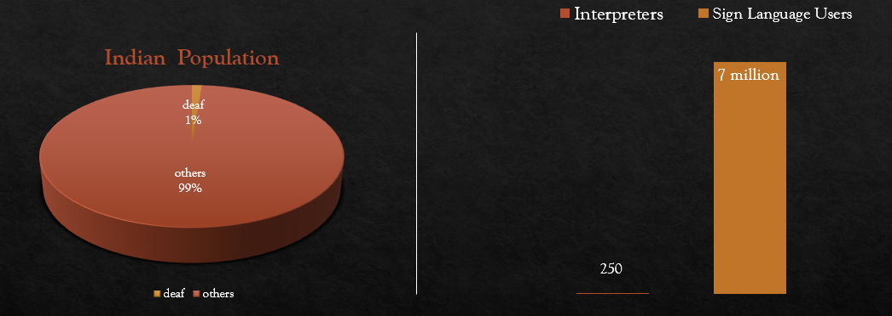
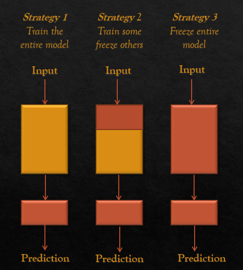
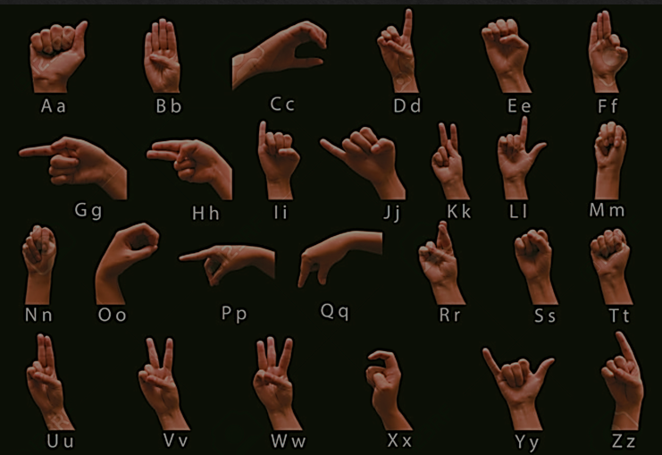
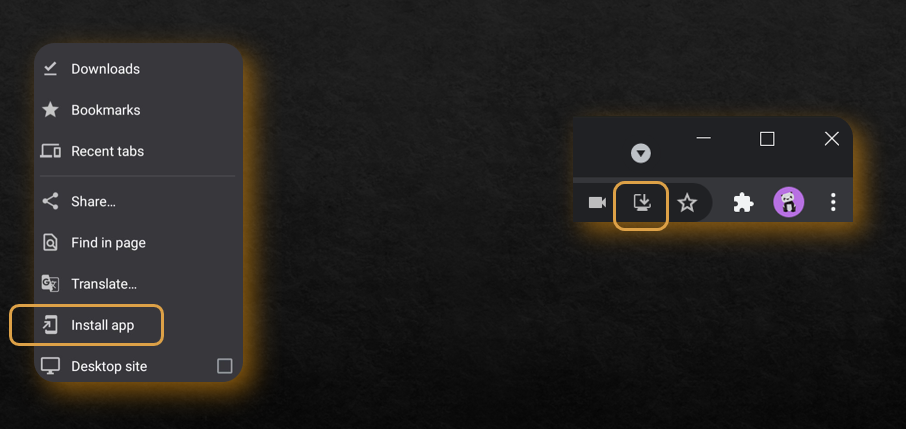

# Vaani: The sign Language Detection App
## Problems that the society faces
    According to the 2011 census of India there are 7 million active sign language users and only 250 certified interpreters of the whopping 1.36 billion population. We recognized the need to bridge this gap and create an inclusive community for them. 

## Our app converts the sign language into text.

we have implemented it using:  
1. VGG16 Model of Tensorflow 
2. OpenCv
3. PWA

## Machine Learning Model that we have implemeted - 
 
 

    In VGG16 there are 5 blocks of Convo-pool layers, we removed the last layers up to fully connected layers and then added our custom dense layer which had 28 output classes.
We trained our fine-tuned VGG 16 model on raw image data

## Fine tuning -

    There are 3 ways to fine tune a model that we have implemented:
    a) Feature extraction
    b) Use the Architecture of the pre-trained model
    c) Train some layers while freeze others

## The Dataset -

    Our sign language dataset consists of 26 alphabet classes and 3 special classes viz. nothing, delete and space, which in total piles up to 23,200 images, 800 images per class.
 The figure is the representation of alphabets in ASL.

## The App:

    We have implemented Progressive Web Apps (PWA) to deliver enhanced capabilities, reliability, and install-ability while reaching anyone, anywhere, on any device with a single codebase.

 

 

[Try it out!](https://vaani-v26.herokuapp.com/)
